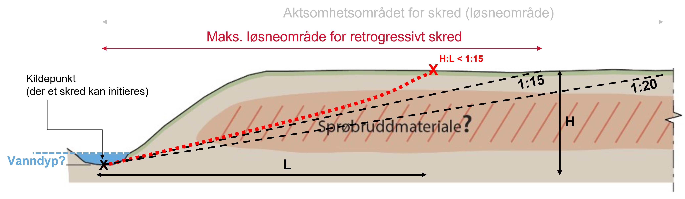

# Quick-Clay Retrogression Module

This module provides two functions to iteratively calculate the propagation of the failure surface in 2D and 3D starting
from an initial failure zone (initial release/source area). 
The module is designed to calculate the retrogression of landslides in quick-clay defined by geometric conditions 
(generally slope greater than 1:15).

The retrogression computation is based on the terrain criteria for landslide retrogression showed in [NVE Kvikkleireveileder 1/2019](https://publikasjoner.nve.no/veileder/2019/veileder2019_01.pdf).



## Usage

```python
import rasterio
import landslide_retrogression

# import dem and release raster
with rasterio.open("dem.tif") as src:
    dem_array = src.read(1)
    transform = src.transform
    profile = src.profile
rel = landslide_retrogression.rasterize_release("release.shp", profile)
# or
# with rasterio.open("release.tif") as src_rel:
#     rel = src_rel.read(1)

release_result = landslide_retrogression.landslide_retrogression_3d(dem_array, rel, transform,
                                            verbose=False, min_slope=1/15,
                                            initial_release_depth=1.5)

landslide_retrogression.polygonize_results(release_result, profile, "results_polygons.shp")
# or:
landslide_retrogression.save_results(release_result, profile, "results_raster.tif")
```

or from command line:

```bash
python landslide_retrogression.py --dem_path dem.tif --source_path release.shp --out_path results_polygons.shp --verbose False --min_slope 1/15 --initial_release_depth 1.5
```